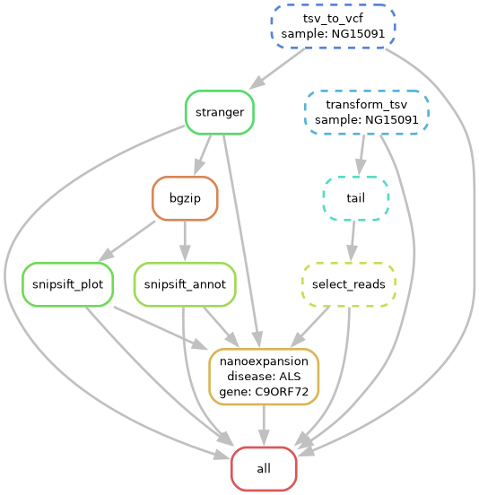

# NanoExpansion: a tool for the characterization of Repeat Expansion Patterns in Nanopore sequencing samples

NanoExpansion is a python software for the extraction and characterization of Short Tandem Repeats (STRs) data from nanopore sequencing.
It exploits the result from [straglr](https://github.com/bcgsc/straglr) to generate plots of the expansion site of the region of interest (e.g. gene *DMPK* for DM1) and to return the compact expansion pattern string.
This software reuses some ideas that can be found in [EPI2ME wf-human-variation](https://github.com/epi2me-labs/wf-human-variation).

## Requirements

Some files are needed in order to run NanoExpansion:

* a sorted and indexed .bam file of the sample of interest
* .tsv and .vcf (optional) output files from straglr
* the catalogue of STR annotation for Stranger
* a .bed file with the region and the motif of expansion

Moreover, the folder structure must be the following

```
sample/
│
├── nanoexpansion/
    ├── <sample>-straglr.tsv
    ├── <sample>-straglr.vcf    
    ├── <sample>.sort.bam    
    ├── <sample>.sort.bam.bai    
    ├── variant_catalog_hg38.json    
    ├── <gene>_filter.bed    
    └── str_repeats.bed
```

and the required files must be inside nanoexpansion folder.

Depending on the straglr version used, you would need to transform the output .tsv file in order to have only the following columns:

'chrom', 'start', 'end', 'repeat_unit', 'genotype', 'read', 'copy_number', 'size', 'read_start', 'strand', 'allele'

If your .tsv file does not satisfy this requirement, you should first run

```bash
python transform_straglr_tsv.py --input <sample>-straglr_old.tsv --output <sample>-straglr.tsv
```

If your version of straglr does not output the .vcf file, you can create it starting from the .tsv and the .bed files (both generated by straglr), by running:

```bash
python create_vcf_file.py --tsv <sample>-straglr.tsv --bed <sample>-straglr.bed --vcf <sample>-straglr.vcf
```

## Pre-processing

1. Download the repository

    ```bash
    git clone https://github.com/Cesco16/NanoExpansion.git
    cd NanoExpansion
    ```

2. Create and activate the conda environment 

    ```bash
    conda env create -f requirements.yaml
    conda activate nanoexpansion
    ```

3. Index .bam STR file and keep only reads with STR of interest

    ```bash
    samtools view -b -h -o <sample>_roi.bam -L <gene>_filter.bed <sample>_sort.bam
    samtools index <sample>_roi.bam
    ```
    ```bash
    tail -n +3 <sample>_straglr.tsv | cut -f 6 > <sample>_filtered_reads.txt
    ```
    ```bash
    samtools view --write-index -N <sample>_filtered_reads.txt -o <sample>_reads.bam <sample>_roi.bam
    ```

4. Annotate .vcf using Stranger

    ```bash
    stranger -f variant_catalog_hg38.json <sample>_straglr.vcf > <sample>_straglr_annot.vcf | sed 's/\\ / _/g'
    ```
    ```bash
    bgzip <sample>_straglr_annot.vcf
    tabix <sample>_straglr_annot.vcf.gz
    ```

5. Extract fields of interest
    ```bash
    SnpSift extractFields <sample>_straglr_annot.vcf.gz CHROM POS ALT FILTER REF RL RU REPID VARID STR_STATUS > <sample>_ann.tsv
    SnpSift extractFields <sample>_straglr_annot.vcf.gz CHROM POS DisplayRU STR_NORMAL_MAX STR_PATHOLOGIC_MIN VARID Disease > <sample>_plt.tsv
    ```

N.B. Please, do not change the filenames created in steps 3-5.

## NanoExpansion

6. Execute NanoExpansion
    ```bash
    python NanoExpansion.py --sample <sample> --repeat CAG --interruption CAA --path /path/to/sample/nanoexpansion/
    ```

### Options

| Option                  | Description                                                                               |
|-------------------------|-------------------------------------------------------------------------------------------|
| `--sample <STR>`        | ID of the sample to process. **Required.**                                                |
| `--path <STR>`          | Path to the directory with the files generated by the pre-processing steps. **Required.** |
| `--repeat <STR>`        | Main repeat motif. Default is `CAG`                                                       |
| `--interruption <STR>`  | Interruption repeat motif. Default is `CAA`.                                              |
| `--ins1 <INT>`          | Threshold for correction of main repeat motif. Default is 3.                              |
| `--ins2 <INT>`          | Threshold for correction of interruption repeat motif. Default is 1.                      |
| `--help`                | Show the help message and exit.                                                           |


## Example of usage

Here an example of NanoExpansion applied to a patient affected by Mytonic Dystrophy type 1 (DM1), which is characterized by an expansion of the CTG triplet in gene *DMPK*.
Thanks to NanoExpansion, it is possible to characterize the wild-type and the mutated allele.
The numbers in the plots represents the number of nucleotides in each region. The number of repeats is obtained dividing those numbers by the length of the repeat motif (in this case, 3).


and also the mutated reads. Here an example of an expanded read, that shows a TTG interruption pattern:


Finally, NanoExpansion returns the complete characterization of repeat patterns in all the available reads:

```
1145b1e2-58bb-433c-afa1-939a27d713f3 :  (CTG)8
fddbf9a9-73b1-4bfb-bab8-4e386dad1720 :  (CTG)12
15234493-05c1-45e8-a844-6a8f88846125 :  (CTG)12
9ae4ba29-c4f2-493e-b67a-74254b9bd9a5 :  (CTG)11
551d2b3a-7a47-4dc9-bd14-d6e227cffab3 :  (CTG)648(TTG)1(CTG)132
8b3c7dcb-3e01-4642-b1c0-7fa506faf26c :  (CTG)114(TTG)757(CTG)91
17c4a40a-8861-4141-99aa-f5a9440e5166 :  (CTG)12
7cae6e57-bd34-4410-aac5-1bb2024430be :  (CTG)87(TTG)317(GTC)(TTG)145(TGTCG)(TTG)21(TCG)(TTG)234(TC)(TTG)237(CTG)38
503ccf68-7c1c-4350-a7cf-83d1ae02b101 :  (CTG)12
8ca91fb6-e90c-4fde-828d-4d9df868ae6a :  (CTG)12
fa9331e7-441a-4d13-bace-b6b2c5e11a40 :  (CTG)69(CCGCCG)(CTG)35(CCGCCGCCG)(CTG)22(TTG)118(TCG)(TTG)31(TCG)(TTG)123(CTG)118(CCGCCCG)(CTG)198
```

<!--
## Snakemake

The Snakemake pipeline implementation of NanoExpansion is available.
It starts by running straglr on the bam file up to executing NanoExpansion.

To run the Snakemake pipeline (after activating the conda environment):

```bash
snakemake --cores N --config sample=<sample_name> motif=<motif_value> interruption=<interruption_value> ins1=<ins1_value> ins2=<ins2_value> gene=<gene> disease=<disease>
```

An example for an ALS patient and gene *C9ORF72* is:

```bash
snakemake --cores 4 --config sample=NG15091 motif='CCCCGG' interruption='GAG' ins1=10 ins2=7 gene="C9ORF72" disease="ALS"
```

The DAG of the snakemake pipeline is shown below:


<div align="center">
  
</div>
-->

### N.B.
* Actually, NanoExpansion works only with hg38 genome reference. The extension to T2T HS1 reference will be released soon.
* Always check the start-end columns in files .tsv and .bed: they must be the start-end position of the repeat expansion region (manually change them if needed).
* To test the software, ask the repository owner to provide a test file (.bam and .tsv), since the size of the .bam file exceeds the github maximum limit.
* The Snakemake pipeline will be fixed and released soon.


## License

This project is licensed under the [MIT License](LICENSE).  
You are free to use, modify, and distribute this software under the terms of the license.

## Citation

If you use NanoExpansion in your research or work, please cite the GitHub repository:

```
@misc{NanoExpansion
author = {Francesco Casadei},
title = {NanoExpansion: a tool for the characterization of Repeat Expansion Pattern in Nanopore sequencing samples},
year = {2025},
publisher = {GitHub},
journal = {GitHub repository},
howpublished = {\url{https://github.com/Cesco16/NanoExpansion)}
}
```
