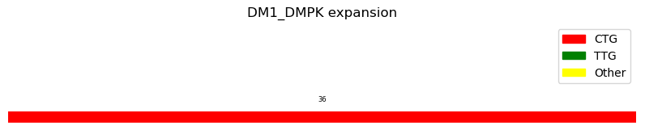
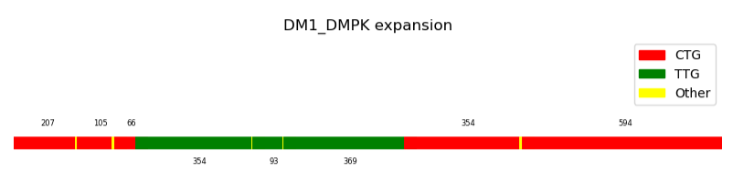

# NanoExpansion

Tool for extraction and characterization of Short Tandem Repeats (STRs) data from nanopore sequencing.

## How to use NanoExpansion

1. Download the repository

2. Create and activate the conda environment 

```bash
conda env create -f requirements.yaml

```

```bash
conda activate nanoexpansion
```

3. Index .bam STR file

```bash
samtools view -b -h -o native9411_str_regions.bam -L ../native13204/bed_filter.bed native9411_sort.bam
```
```bash
samtools index native9411_str_regions.bam
```
```bash
tail -n +3 native9411_straglr.tsv | cut -f 6 > reads_to_filter.txt
```
```bash
samtools view --write-index -N reads_to_filter.txt -o native9411_str_reads.bam
```

4. Annotate .vcf using Stranger

```bash
stranger -f ../variant_catalog_hg38.json native9411_straglr.vcf > native9411_straglr_annot.vcf | sed 's/\\ / _/g'
```
```bash
bgzip native9411_straglr_annot.vcf
```
```bash
tabix native9411_straglr_annot.vcf.gz
```

5. Extract fields of interest
```bash
SnpSift extractFields native9411_straglr_annot.vcf.gz CHROM POS ALT FILTER REF RL RU REPID VARID STR_STATUS > native9411_rep_annot.tsv
```
```bash
SnpSift extractFields native9411_straglr_annot.vcf.gz CHROM POS DisplayRU STR_NORMAL_MAX STR_PATHOLOGIC_MIN VARID Disease > native9411_rep_plot.tsv
```

6. Execute NanoExpansion
```bash
NanoExpansion.py --sample 9411native --repeat CAG --interruption CAA --path /path/to/file/GridIon
```

N.B. Please, do not change the filenames created in steps 3-5.

## Example of usage

Here an example of NanoExpansion applied to a patient affected by Mytonic Dystrophy type 1 (DM1), which is characterized by an expansion of the CTG triplet in gene *DMPK*.
Thanks to NanoExpansion, it is possible to characterize the wild-type allele:



and also the mutated reads. Here an example of an expanded read, that shows a TTG interruption pattern:



Finally, NanoExpansion returns the complete characterization of repeat patterns in all the available reads:

1145b1e2-58bb-433c-afa1-939a27d713f3 :  (CAG)8
fddbf9a9-73b1-4bfb-bab8-4e386dad1720 :  (CAG)12
15234493-05c1-45e8-a844-6a8f88846125 :  (CAG)12
9ae4ba29-c4f2-493e-b67a-74254b9bd9a5 :  (CAG)11
551d2b3a-7a47-4dc9-bd14-d6e227cffab3 :  (CAG)648(CAA)1(CAG)132
8b3c7dcb-3e01-4642-b1c0-7fa506faf26c :  (CAG)114(CAA)757(CAG)91
17c4a40a-8861-4141-99aa-f5a9440e5166 :  (CAG)12
7cae6e57-bd34-4410-aac5-1bb2024430be :  (CAG)87(CAA)317(GAC)(CAA)145(CGACA)(CAA)21(CGA)(CAA)234(GA)(CAA)237(CAG)38
503ccf68-7c1c-4350-a7cf-83d1ae02b101 :  (CAG)12
8ca91fb6-e90c-4fde-828d-4d9df868ae6a :  (CAG)12
fa9331e7-441a-4d13-bace-b6b2c5e11a40 :  (CAG)69(CGGCGG)(CAG)35(CGGCGGCGG)(CAG)22(CAA)118(CGA)(CAA)31(CGA)(CAA)123(CAG)118(CGGGCGG)(CAG)198
