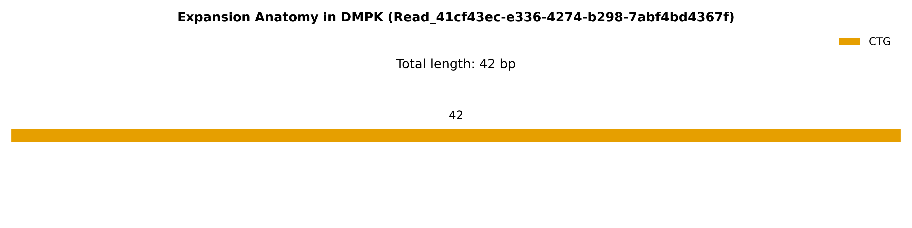
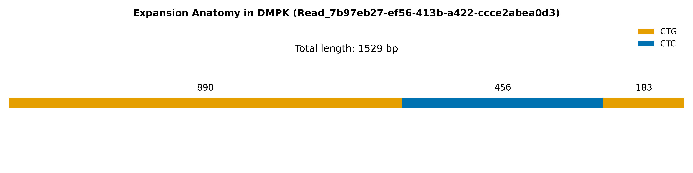
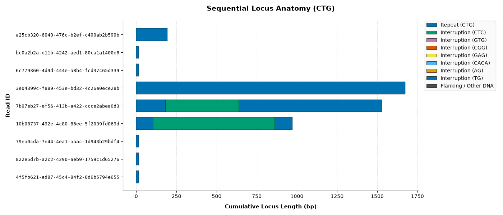
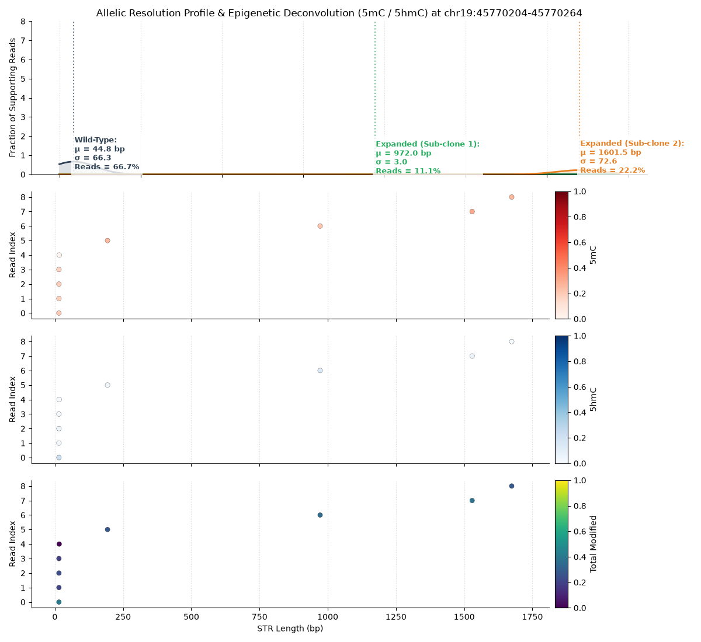
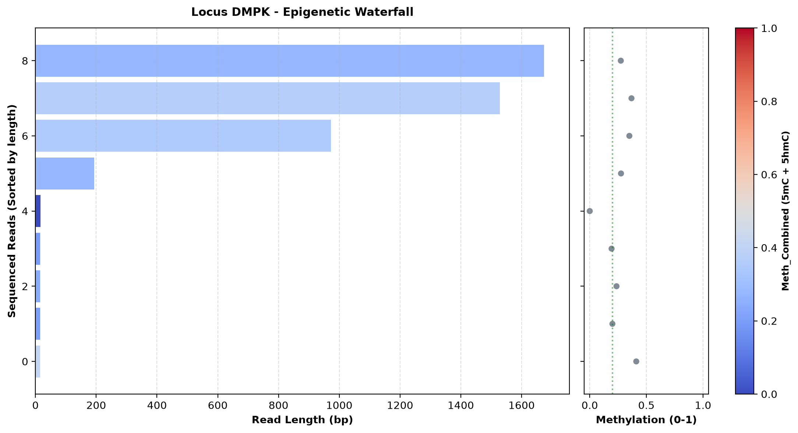
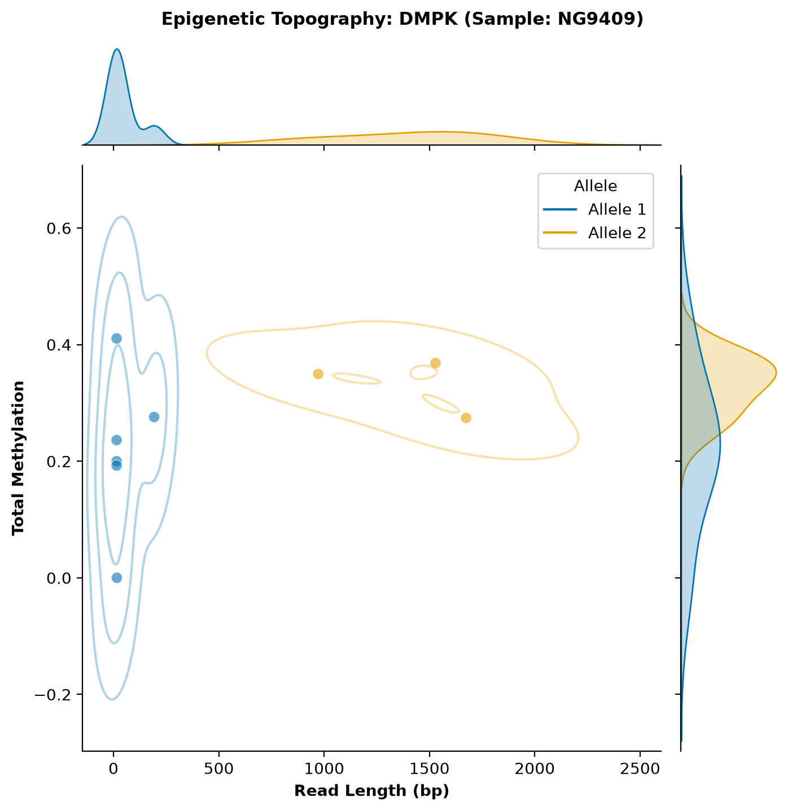
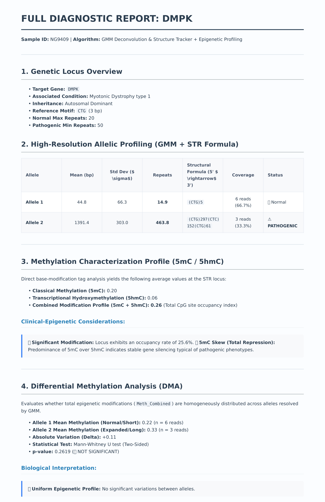

# NanoExpansion (NanoExp)

**Characterization of pathogenic short tandem repeat (STR) expansions from Oxford Nanopore long-read sequencing data.**

NanoExpansion is a Python pipeline that, starting from a BAM alignment and a reference genome, measures the length and internal structure (repeat motif, interruptions, somatic mosaicism) of clinically relevant STR loci (e.g. *C9orf72*, *DMPK*, *HTT*, *RFC1*, ...), producing reports, synthetic clinical formulas (e.g. `(CAG)20(CAA)2`) and publication-ready plots.

---

## Table of contents

- [Features](#features)
- [How it works](#how-it-works)
- [Requirements](#requirements)
- [Installation](#installation)
- [Quick start](#quick-start)
- [Command-line options](#command-line-options)
- [Supported loci](#supported-loci)
- [Output](#output)
- [Repository structure](#repository-structure)
- [Known limitations](#known-limitations)
- [Citation](#citation)
- [License](#license)

---

## Features

- **Robust extraction of the repeat region** from aligned reads, anchored via approximate alignment (edit distance, using `edlib`) of the flanking sequences, gracefully handling reads truncated upstream or downstream of the locus.
- **Allele number and length estimation** via Gaussian Mixture Model (GMM) fitting on the observed length distribution, with an automatic fallback for low-coverage samples.
- **Somatic mosaicism index** computed from the identified alleles.
- **Alternative motif/k-mer profiling** across the locus, useful for detecting recurrent repeat interruptions (e.g. *interrupted* vs *pure* alleles in *DMPK*/*C9orf72*).
- **Anatomical structural segmentation** of each read into `Repeat` / `Interruption` / `Other` blocks, with automatic generation of the allele's synthetic clinical formula.
- **Markdown/HTML diagnostic reports** ready to share, with automatic normal/pathogenic classification based on the reference database thresholds.
- **Publication-ready plots** colored linear block map for each identified allele, length distribution with GMM peaks, methylation (5mC/5hmC) waterfall plot when available in the BAM tags.
- **Built-in pathogenic STR loci database** (inspired by [STRchive](https://strchive.org/)), easily extendable to new genes/loci.

## How it works

The pipeline (`main.py`) runs the following steps in sequence:

1. **Read extraction**: for every read covering the target locus in the BAM file, the reference flanking sequences (left/right flank) are aligned against the read with `edlib` to isolate the portion of sequence corresponding to the repeat region, computing its length and motif purity.
2. **Population statistics**: computes the somatic mosaicism index and estimates the number of alleles (GMM components) present in the length distribution.
3. **Motif profiling**: identifies the most frequent k-mers at the locus, including any recurrent interruptions.
4. **Structural segmentation**: breaks down each read into typed blocks (Repeat/Interruption/Other) and derives a synthetic clinical formula (e.g. `(CAG)45(CAA)2(CAG)3`).
5. **Reporting and plotting**: generates clinical reports and diagnostic plots, plus a text file listing the structural formula of every read in the cohort.

All functions are defined in [`utils.py`](utils.py); pipeline orchestration and the command-line interface live in [`main.py`](main.py).

## Requirements

- Python ≥ 3.9
- `pysam`
- `edlib`
- `numpy`
- `pandas`
- `matplotlib`
- `seaborn`
- `scikit-learn`
- `scipy`
- `markdown`

Required input files:
- a coordinate-sorted, indexed **BAM** file (`.bai`);
- an indexed **FASTA** reference genome (`.fai`);
- (optional) base-modification tags (`MM`/`ML`) in the BAM for 5mC/5hmC methylation analysis.

## Installation

```bash
git clone https://github.com/Cesco16/NanoExpansion.git
cd nanoexpansion

conda env create -f nanoexpansion.yaml
conda activate NanoExpansion

```


## BAM preprocessing

It could be convenient filtering the BAM file by selecting only the regions of interest to speed up NanoExpansion execution:

```bash
samtools view -b -h -o sample_str_regions.bam -L <gene>_filter.bed sample.bam -@ 32
samtools index sample_str_regions.bam

```

## Quick start

```bash
python main.py \
  --bam sample_str_regions.bam \
  --fasta ref.fa \
  --gene <gene> \
  --sample <sampleID> \
  --outdir output/<sampleID>/nanoexpansion/
```

For a locus not present in the built-in database, or to use a different assembly, coordinates can be specified manually:

```bash
python main.py \
  --bam sample_str_regions.bam \
  --fasta custom_reference.fa \
  --gene MY_LOCUS \
  --chrom chr1 --start 1000000 --end 1000060 \
  --motif CAG --strand forward \
  --sample sample01 \
  --outdir output/sample01/
```

## Command-line options

| Option | Required | Description |
|---|---|---|
| `--bam` | ✅ | Aligned, indexed BAM file |
| `--fasta` | ✅ | Indexed FASTA reference genome |
| `--gene` | ✅ | Target gene/locus name (see [Supported loci](#supported-loci)) |
| `--sample` | ✅ | Sample ID, used to name output files |
| `--outdir` | ✅ | Output directory for reports and plots |
| `--chrom`, `--start`, `--end`, `--motif`, `--strand` | ❌ | Manual locus override (required together if `--gene` is not in the built-in database) |
| `--interrupt-motifs` | ❌ | List of expected interruption motifs (default: generic set); pass with no arguments to enable automatic detection |
| `--filt` | ❌ | Maximum length of "flicker" blocks removed during smoothing (default: `20`) |
| `--min-other-len` | ❌ | Minimum length of `Other` segments to avoid being merged with neighbors (default: `50`) |
| `--hysteresis` | ❌ | Hysteresis tolerance used in structural segmentation (default: `0.5`) |
| `--max-gmm-components` | ❌ | Maximum number of components tested in GMM fitting (default: `3`) |

Full list available via `python main.py --help`.

## Supported loci

The built-in reference database (`utils.STR_REFERENCE_DB`, inspired by [STRchive](https://strchive.org/)) includes hg38/T2T coordinates, repeat motif, strand and normal/pathogenic thresholds for:

| Gene | Disease | Motif | Inheritance |
|---|---|---|---|
| `C9ORF72` | ALS / FTD | CCCCGG | Autosomal Dominant |
| `RFC1` | CANVAS | GGGAA | Autosomal Recessive |
| `HTT` | Huntington disease | CAG | Autosomal Dominant |
| `DMPK` | Myotonic Dystrophy type 1 | CAG | Autosomal Dominant |
| `FGF14` | SCA27 | GAA | Autosomal Dominant |
| `BEAN1` | SCA31 | AAAAT | Autosomal Dominant |
| `DAB1` | SCA37 | AAAAT | Autosomal Dominant |
| `AR` | Kennedy disease | CAG | Autosomal Dominant |
| `ATXN3` | SCA3 | CTG | Autosomal Dominant |

New loci can be added by extending the `STR_REFERENCE_DB` dictionary in `utils.py`, or passed at runtime via `--chrom/--start/--end/--motif/--strand`.

Benchmark examples must be run using BENCHMARK as gene locus (and adjusting the --filt, --min-other-len, and --hysteresis parameters accordingly).

## Output

For each run, the following files are generated in `--outdir`:

- `<sample>_<gene>.txt` — text file listing the structural formula (e.g. `(CAG)45(CAA)2`) of every read in the cohort.
- `<read_id>_<gene>.png/.svg` — colored linear block map of the structure of each identified allele.

<div align="center">

</div>
<div align="center">

</div>

- `sequential_locus_structure.png` — length distribution with GMM peaks and, when available, methylation profile.

<div align="center">

</div>


- `gmm_dual_methylation.png` — length distribution with GMM peaks and, when available, methylation profile.

<div align="center">

</div>

- `EPIGENETIC_WATERFALL_<sample>_<gene>.png` — per-allele methylation waterfall plot (if the BAM contains base-modification tags).
  
<div align="center">

</div>

- `EPIGENETIC_JOINT_MAP_<sample>_<gene>.png` — per-allele methylation waterfall plot (if the BAM contains base-modification tags).

<div align="center">

</div>

- `FULL_REPORT_<sample>_<gene>.html` — diagnostic report with GMM alleles and methylation (5mC/5hmC) profile.

<div align="center">

</div>


## Repository structure

```
.
├── benchmark/          # Benchmark files for testing or performance evaluation
├── example_output/     # Example output files generated by the tool
├── filters/            # Filter files (e.g., BED files for region selection)
├── images/             # Images used in documentation or examples
├── legacy_v0.0.1/      # Legacy files from version 0.0.1 (e.g., old BED/STR repeats)
├── scripts/            # Scripts with functions and pipeline orchestration
│   ├── main.py         # Command-line interface and pipeline orchestration
│   └── utils.py        # Analysis, statistics, segmentation, and reporting 
├── nanoexpansion.yaml  # Conda environment configuration file
├── LICENSE             # License file (MIT)
└── README.md           # Project documentation

```

## Known limitations

- The pipeline analyzes a single STR locus at a time (one run = one gene/sample).
- Methylation analysis requires base-modification tags (`MM`/`ML`) in the BAM (typically produced by basecalling with modification-aware models, e.g. Dorado/Guppy with 5mC/5hmC models).
- The normal/pathogenic thresholds included in the database are indicative and derived from the literature; they do not replace clinical interpretation by a qualified professional.

## Disclaimer

- NanoExpansion is currently under active development. Several features are still being refined, and functionality will be expanded in future updates (e.g., simultaneous analysis across multiple loci).

- NanoExpansion is not intended for diagnostic purposes. The information generated is designed to support specialists in their work and should not be used as a standalone diagnostic solution.

## Citation

If you use NanoExpansion in your research or work, please cite the GitHub repository:

```
@misc{NanoExpansion
author = {Francesco Casadei},
title = {NanoExpansion (NanoExp)},
year = {2026},
publisher = {GitHub},
journal = {GitHub repository},
```

## License

This project is licensed under the [MIT License](LICENSE).  
You are free to use, modify, and distribute this software under the terms of the license.
